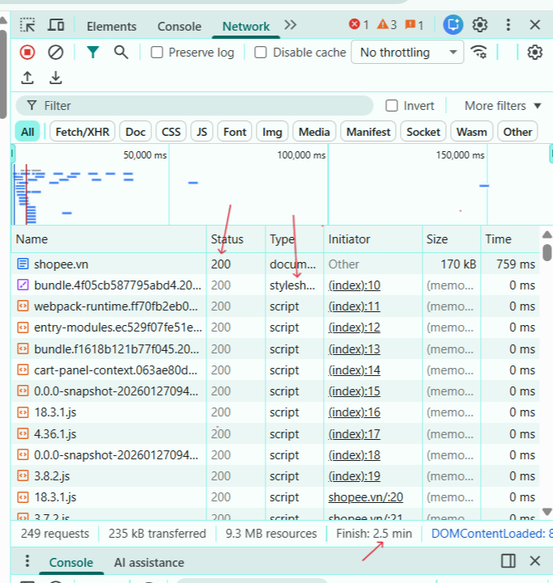

## Phần A
### Câu A1:HTTP & Browser 
- Nguồn tham chiếu: 
    - 01_introduction_html_universe.md 
    - Phần: 1.1.Kiến trúc Client-Server + 4.3 Developer tools

1.Khi gõ https://shopee.vn vào trình duyệt và nhấn enter:
- DNS Lookup:Trình duyệt phân giải tên miền shopee thành địa chỉ IP của máy chủ.
- Client tạo kết nối mạng với Server.
- Client gửi yêu cầu (gõ URL shopee.vn).
- Gửi HTTP Request: Sever nhận yêu cầu của Client, Internet vận chuyển request này đi.
- Sever xử lý yêu cầu.
- Trả HTTP response:Sever trả kết quả, Internet vận chuyển response về lại Client.
- Render:Trình duyệt hiển thị giao diện trang web lên màn hình.

2.Trong DevTools của Chrome:
- tab Network cho thấy:
    - Toàn bộ quá trình giao tiếp mạng giữa trình duyệt và máy chủ
    - Nó hiển thị danh sách cá tài nguyên được tải về như HTML,DOC,CSS,JS,IMG,API,... và mã trạng thái(Status), phương thức, dung lượng file và thời gian tải của từng request.
- Network và đánh dấu:


### Câu A2:Semantic HTML
- Nguồn tham chiếu:   
    - 04_visible_part_html.md
    - phần: Semantic HTML5 — "Thẻ có ý nghĩa"

1. Trang web dưới đây bị Google đánh giá SEO thấp vì:
    - Nó đang mắc lỗi "Div Soup" lạm dụng `<div>` cho mọi thứ khiến cho Google không hiểu được cấu trúc của trang web

2. Các lỗi semantic:
    - Dùng `<div class="header">` cho phần đầu chứa Logo và menu chính. Phải dùng thẻ  `<header>`.
    - Dùng `<div class="menu">` cho phần điều hướng. Phải dùng thẻ `<nav>`.
    - Dùng `<div class="main">` cho phần nội dung chính. Phải dùng thẻ `<main>`.
    - Dùng `<div class="product">` cho việc chứa thông tin sản phẩm. Phải dùng thẻ `<article>`.
    - Dùng `<div class="footer">` cho phần cuối trang. Phải dùng thẻ `<footer>`.

### Câu A3:Block vs Inline
- Nguồn tham chiếu:
    - 04_visible_part_html.md
    - phần: Block vs Inline — Hai loại element cơ bản

1.Mô tả kết quả hiển thị:

    Hộp 1
    Text A Text B
    Hộp 2
    Text C **Text D**
    Hộp 3

2.Giải thích:
- Thẻ `<div>` sẽ chiếm toàn bộ 1 dòng và tự bắt đầu ở 1 dòng mới nên 'Hộp 1', 'Hộp 2', 'Hộp 3' đều nằm trên 1 dòng riêng biệt.
- Thẻ `<span>` và `<strong>` chúng chỉ chiếm không gian đủ cho nội dung và không ép xuống dòng nên:
    - 'Text A' và 'Text B' nằm cạnh nhau trên 1 dòng.
    - Tương tự với 'Text C' và 'Text D'. Riêng thẻ `<strong>` còn có thêm định dạng in đậm cho chữ nên 'Text D' được in đậm.

### Câu A4: Table
- Nguồn tham chiếu:
    - 05_tables_hyperlinks.md
    - phần: Table — Bảng dữ liệu

1.Sự khác nhau giữa `<thead>`, `<tbody>`, `<tfoot>`:
- `<thead>` là phần tiêu đề của bảng định nghĩa tên các cột.
- `<tbody>` là phần dữ liệu chính của bảng chứa nội dung.
- `<tfoot>` là phần tổng kết ở cuối bảng thường để tính tổng.

2.Không nên dùng table để tạo layout trang web vì:
- Thẻ `<table>` sinh ra chỉ có mục đích duy nhất là hiển thị dữ liệu dạng bảng nên các công cụ tìm kiếm như Google sẽ hiểu sai cấu trúc trang web
- Để chia bố cục bằng bảng sẽ phải dùng rất nhiều thẻ `<tr>`, `<td>`, `colspan`,`rowspan`. Điều này sẽ khiến cho code trở nên rối, file HTML bị nặng hơn, khó đọc và khó chỉnh sửa.
- Dùng bảng cho toàn bộ giao diện sẽ khiến tốc độ hiển thị nội dung trang web chậm hơn vì phải tải và tính toán kích thước của toàn bộ nội dung trong bảng.

## Phần C
### Câu C1: Thiết kế cấu trúc
```html
<header> <!-- header vì đây là phần đầu chứa logo/menu -->
    <nav> <!-- nav vì đây là điều hướng -->
        <a href="#home">Trang chủ</a>
        <a href="#product">Sản phẩm</a>
        <a href="#contact">Liên hệ</a>
    </nav>
</header>

<nav> <!-- nav vì đây là điều hướng -->
    <ol> <!-- ol vì breadcrumb có thứ tự -->
        <li><a href="#">Trang chủ</a></li>
        <li><a href="#">Điện thoại</a></li>
        <li><a href="#">iPhone 16</a></li>
    </ol>
</nav>

<main> <!-- main vì đây là nội dung chính -->
    <section> <!-- section vì đây là nhóm nội dung riêng biệt -->
        <h2>Hình ảnh sản phẩm</h2> <!-- h2 vì là tiêu đề phụ -->
        <figure> <!-- figure vì đây là nhóm ảnh -->
             <!-- img vì là ảnh, alt vì là mô tả -->
            
            
            
            
        </figure>
    </section>


    <article> <!-- article vì đây là nội dung độc lập của 1 sản phẩm -->
        <h2>iPhone 16 Pro Max</h2> <!-- h2 vì là tiêu đề phụ -->
        <p>Giá: 18.000.000</p>
        <p>Đánh giá: ⭐⭐⭐⭐</p>
        <p>Mô tả: Chip A18, Camera 36MP.</p>
    </article>

    <section> <!-- section vì đây là nhóm nội dung riêng biệt -->
        <h2>Thông số kỹ thuật</h2> <!-- h2 vì là tiêu đề phụ -->
        <table> <!-- table vì đây là bảng -->
            <tr><th>Màn hình</th><td>6.7 inch</td></tr> <!-- th là tiêu đề cột, td là nội dung, tr là một hàng-->
            <tr><th>Ram</th><td>8GB</td></tr>
            <tr><th>Bộ nhớ</th><td>256GB</td></tr>
        </table>
    </section>

    <section> <!-- section vì đây là nhóm nội dung riêng biệt -->
        <h2>Đánh giá</h2> <!-- h2 vì là tiêu đề phụ -->
        <p><strong>Người dùng A:</strong> Hài lòng</p> <!-- strong để in đậm chữ -->
        <p><strong>Người dùng B:</strong> Quá đắt</p>
    </section>
</main>

<aside> <!-- adide vì là nội dung phụ -->
    <h2>Sản phẩm tương tự</h2> <!-- h2 vì là tiêu đề phụ -->
    <ul> <!-- ul vì là danh sách không cần thứ tự -->
        <li><a href="#">iPhone 15</a>></li> <!-- li là phần tử trong danh sách -->
        <li><a href="#">iPhone 14</a>></li>
    </ul>
</aside>

<footer> <!-- footer vì đây là thông tin cuối trang -->
    <p>&copy; 2026 ShopTLU. All rights reserved.</p>
</footer>
```

### Câu C2: So sánh & Tranh luận

Theo góc nhìn của bạn dùng `<div>` kết hợp class có thể tiết kiệm thời gian học thẻ mới mà giao diện tạo ra vẫn y hệt, tuy nhiên việc bỏ qua Semantic HTML sẽ gây ra những hậu quả kỹ thuật nghiêm trọng.
Thứ nhất, về SEO(Tối ưu hóa công cụ tìm kiếm) các công cụ tìm kiếm như Google sẽ chỉ đọc mã nguồn nên khi bạn dùng các thẻ như `<main>`, `<article>`, `<nav>`, ..., hệ thống sẽ biết chính xác đâu là nội dung cốt lõi, đâu là menu. Nếu chỉ dùng `<div>` công cụ tìm kiếm sẽ không thể phân tích đúng đâu là nội dung cốt lõi, đâu là menu.
Thứ hai, về Accessibility (Khả năng truy cập), Semantic HTML là cơ sở để các phần mềm đọc màn hình có thể phân tích đúng cấu trúc trang cho người khiếm thị. Các phần mềm này dựa vào các thẻ ngữ nghĩa để nhận diện, cho phép người dùng sử dụng phím tắt để di chuyển đến phần nội dung họ cần. Nếu chỉ dùng thẻ `<div>` không có ý nghĩa phân loại, trình đọc màn hình sẽ xử lý tất cả như một khối liền mạch, khiến người dùng không hiểu được bố cục trang và gặp rào cản trong thao tác và tìm kiếm thông tin.
Ví dụ nếu bạn làm một nút bấm bằng `<div class="btn" onclick="...">`, bạn sẽ phải tự viết thêm JavaScript để nút đó hoạt động khi ấn phím Enter và phỉa thêm thuộc tính tabindex để nó nhận focus từ bàn phím. Trong khi, chỉ cần dùng thẻ `<button>` trình duyệt sẽ tự xử lý toàn bộ tính năng dó mà không cần thêm dòng code nào.
Trên thực tế vẫn có một số trường hợp mà `<div>` vẫn phù hợp. Nó vẫn là lựa chọn tốt trong trường hợp chỉ phục vụ thuần túy cho việc trang trí giao diện. Ví dụ như dùng `<div class="container">` để giới hạn chiều rộng trang web hoặc dùng `<div class="box">` để gom nhóm vài thẻ để tạo một khung viền và đổ màu nền. Lúc này, dùng `<div>` vẫn phù hợp mà không làm sai lệch ý nghĩa cấu trúc HTML.
Tóm lại, việc bạn dùng thẻ `<div>` vẫn tốt khi bạn dùng nó đúng chỗ, nhưng việc học Semantic HTML là quan trọng để bạn xây dựng các trang web chuẩn, thân thiện và dễ bảo trì.
